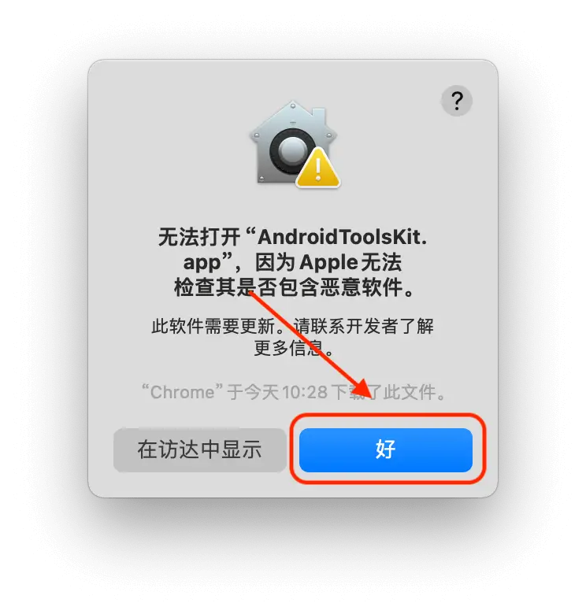
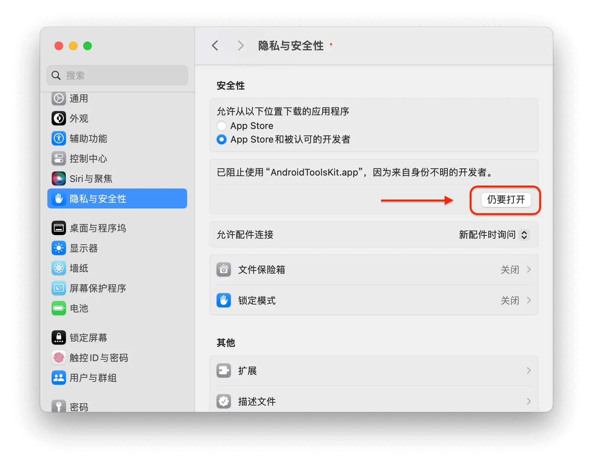
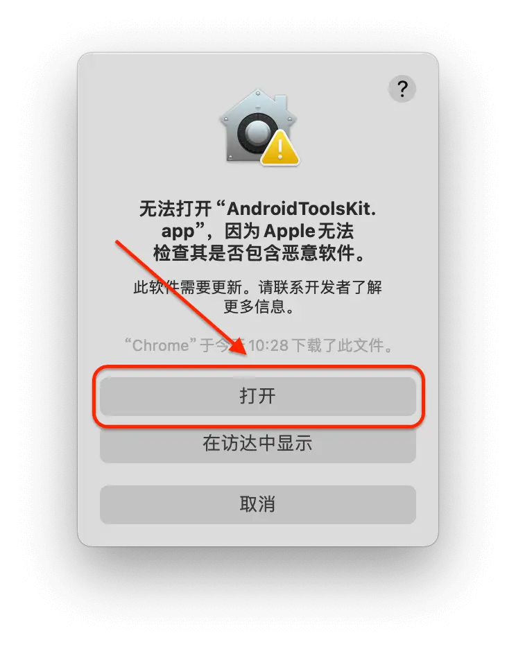
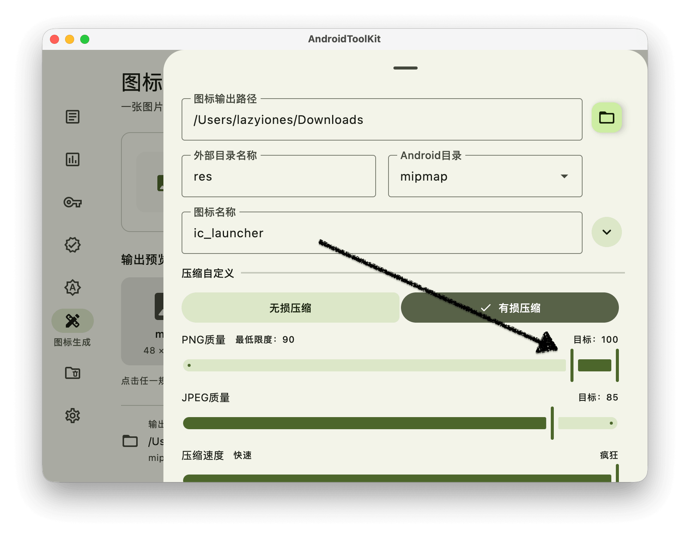

# 常见问题

[返回中文介绍](README.md) · [English README](README_EN.md)

- [安装与启动](#安装与启动)
- [签名与 APK 分析](#签名与-apk-分析)
- [图标生成](#图标生成)
- [缓存清理](#缓存清理)
- [设置与问题反馈](#设置与问题反馈)

## 安装与启动

### 1. macOS 提示“Apple 无法检查其是否包含恶意软件”，怎么办？

确认应用来自本项目的 [Releases](https://github.com/LazyIonEs/AndroidToolKit/releases/latest) 后，按下列步骤操作：

1. 关闭首次打开时的提示框。
2. 进入「系统设置 → 隐私与安全性」，在被阻止的应用提示旁点击「仍要打开」。
3. 在确认窗口中点击「打开」，如有提示则完成系统身份验证。

不同 macOS 版本的界面可能略有差异，下面保留原有操作截图供参考。

| 关闭提示 | 允许打开 | 确认打开 |
|:---:|:---:|:---:|
|  |  |  |

### 2. 如何选择安装包？Windows 安装失败怎么办？

根据系统和处理器选择 [README 下载表](README.md#下载---releases) 中的安装包：macOS 区分 Apple Silicon 与 Intel，Windows 和 Linux 区分 x64 与 ARM64。Linux 平台尚未经充分测试。

Windows 如提示权限不足，可尝试以管理员身份运行安装程序。反馈安装问题时，请附上操作系统版本、处理器架构、安装包名称和完整错误信息。

## 签名与 APK 分析

### 3. 查看签名信息需要输入密码吗？

导入 APK 可直接查看证书与签名验证结果。导入 `.jks` 或 `.keystore` 时，需要按提示输入密钥库密码并选择别名；签名 APK 时还需填写相应的密钥密码。

「签名信息」中的 MD5 / SHA-1 / SHA-256 是证书指纹；「APK 信息 → 文件与校验值」显示的是 APK 文件的校验值，两者用途不同。

### 4. APK 信息页可以查看哪些内容？

导入 APK 后，可切换以下页面：

| 页面 | 内容 |
| --- | --- |
| 包体组成 | APK 总大小、文件数量，以及原生库、DEX、Assets、资源等分类占用；可继续浏览文件 |
| 权限 | Manifest 中声明的权限，可搜索和复制；不代表设备上已经授予的运行时权限 |
| 组件 | 按 Activity、Alias、Service、Receiver、Provider 分类查看组件及详情 |
| 原生库 | 按 ABI 筛选 SO 文件，查看大小与 ELF / ZIP 16 KB 对齐结果 |
| 应用档案 | 版本、SDK、支持架构、启动 Activity、文件名及文件校验值入口 |

原生库的 16 KB 对齐结果属于静态检查，通过后仍需设备运行验证。32 位 ELF 和已压缩 SO 的 ZIP 对齐检查会显示不适用。

## 图标生成

### 5. 出现 `Fail to quantize: QUALITY_TOO_LOW` 怎么办？

这表示 PNG 有损压缩时，量化结果未能满足设置的最低质量要求。在「图标生成 → 更多设置 → 压缩自定义」中任选一种方式调整后重新制作：

- 切换为「无损压缩」。
- 保留「有损压缩」，适当下调「PNG 质量」的「最低限度」。

下图为新版压缩设置界面：

### 6. 生成哪些尺寸？图标保存在哪里？

支持 PNG / JPG / JPEG 源图，页面建议使用 1024 × 1024 px 图片。默认生成以下五种密度：

| 密度 | 像素尺寸 |
| --- | --- |
| mdpi | 48 × 48 |
| hdpi | 72 × 72 |
| xhdpi | 96 × 96 |
| xxhdpi | 144 × 144 |
| xxxhdpi | 192 × 192 |

在「更多设置」中查看或修改图标输出路径、外部目录名称、Android 目录和图标名称。默认外部目录为 `res`，Android 目录为 `mipmap`，图标名为 `ic_launcher`；实际保存位置以页面的「输出位置」为准。

「总览」用于比较五种规格，「大图」用于逐个查看。预览会缩放，尺寸标注才是实际输出像素。

## 缓存清理

### 7. 为什么 `Build`、`build.foo` 或某些文件夹没有被扫描出来？

默认规则只匹配名称严格等于 `build` 的文件夹，并区分大小写。其他名称需要在「管理规则」中添加对应条件。还应检查规则是否启用、目标类型是否正确，以及扫描目录和最大深度是否覆盖目标位置。

同一规则内可要求满足全部或任意条件；不同已启用规则之间，只要命中任意一条就会加入结果。扫描不跟随符号链接，所选根目录本身不会成为删除候选项。

### 8. 编辑规则后如何生效？扫描会直接删除文件吗？

规则在独立窗口中编辑。「保存」应用修改；「保存并试运行」保存后打开目录选择器；「取消」放弃草稿。修改规则配置并保存后，旧扫描结果会清空，需要重新扫描。

扫描只列出匹配项。请核对路径与勾选状态，再确认删除；规则可设置是否默认勾选命中项。删除前会重新检查路径、类型和匹配规则，如果项目已发生变化，则跳过并显示失败原因，可重新扫描后再处理。

## 设置与问题反馈

### 9. 如何调整外观、输出目录或检查更新？

在「设置 → 常规」中修改默认输出路径，选择「跟随系统」「亮色模式」或「暗色模式」，并手动检查更新或设置启动时检查更新。各工具页面也可指定自己的输出位置。

### 10. 问题仍未解决，如何反馈？

请在 [Issues](https://github.com/LazyIonEs/AndroidToolKit/issues) 中提供应用版本、系统版本与架构、复现步骤、完整错误信息和相关截图。文件解析问题可附上可公开的最小示例；请勿上传签名私钥或密码。
