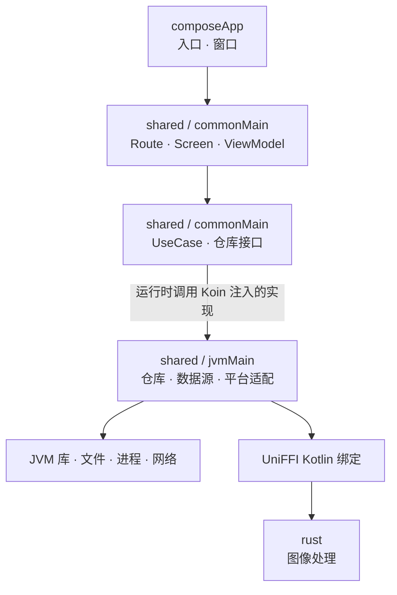

## AndroidToolKit

<p align="start">
<a href="https://opensource.org/license/mit"></a>

<a href="https://github.com/LazyIonEs/AndroidToolKit/actions"></a>
<a href="https://github.com/LazyIonEs/AndroidToolKit/releases/latest"></a>
<a href="https://github.com/LazyIonEs/AndroidToolKit/releases/latest"></a>
<a href="https://kotlinlang.org"></a>
<a href="https://www.rust-lang.org/"></a>
</p>


<!-- 


 -->


简体中文 | [English](./README_EN.md)

面向 Android 开发者的跨平台桌面工具，集成签名查看、APK 分析与签名、证书和 APK 生成、图标制作及缓存清理，支持 Windows、macOS 和 Linux。

[下载最新版本](https://github.com/LazyIonEs/AndroidToolKit/releases/latest) · [界面预览](#界面预览) · [编译运行](#编译与运行) · [常见问题](FAQ.md)

> Linux 平台尚未经充分测试，遇到问题欢迎通过 [Issues](https://github.com/LazyIonEs/AndroidToolKit/issues) 反馈。

## 主要功能

| 功能 | 可以做什么 |
| --- | --- |
| 签名信息 | 导入 APK、JKS 或 Keystore，查看证书主体、有效期、签名算法及 MD5 / SHA-1 / SHA-256 指纹，检查 APK 签名验证结果 |
| APK 信息 | 分析包体组成，浏览文件、权限和组件，按 ABI 查看原生库及 ELF / ZIP 16 KB 对齐结果，读取应用版本、SDK 和文件校验值 |
| APK 签名 | 选择密钥库和别名，为 APK 签名；支持 V1、V2、V2 Only、V3、V4 策略及文件对齐 |
| 签名生成 | 创建密钥库，自定义别名、密码、有效期、证书信息、密钥类型和大小 |
| APK 生成 | 设置应用名称、包名、图标、版本和 SDK，生成 APK，并可选择生成后立即签名 |
| 图标生成 | 从 PNG / JPG / JPEG 生成五种 Android 密度图标，提供总览与大图预览，可配置输出目录、名称和压缩参数 |
| 缓存清理 | 按自定义规则扫描文件或文件夹，预览结果、勾选项目并确认删除 |

支持文件拖入、信息复制，以及跟随系统、亮色和暗色外观；可在设置中调整默认输出路径和更新检查。

## 下载 - [Releases](https://github.com/LazyIonEs/AndroidToolKit/releases/latest)

|   设备    |          芯片           |                                                                                                                                                                                                                  下载                                                                                                                                                                                                                   |
|:-------:|:---------------------:|:-------------------------------------------------------------------------------------------------------------------------------------------------------------------------------------------------------------------------------------------------------------------------------------------------------------------------------------------------------------------------------------------------------------------------------------:|
|  macOS  | Apple Silicon (arm64) |                                                                                                                 <a href="https://github.com/LazyIonEs/AndroidToolKit/releases/latest/download/AndroidToolKit-macos-arm64.dmg"></a>                                                                                                                 |
|  macOS  |      Intel (x64)      |                                                                                                                    <a href="https://github.com/LazyIonEs/AndroidToolKit/releases/latest/download/AndroidToolKit-macos-x64.dmg"></a>                                                                                                                    |
| Windows |   x64 (Intel / AMD)   |     <a href="https://github.com/LazyIonEs/AndroidToolKit/releases/latest/download/AndroidToolKit-windows-x64.msi"></a> <a href="https://github.com/LazyIonEs/AndroidToolKit/releases/latest/download/AndroidToolKit-windows-x64.exe"></a>     |
| Windows |         ARM64         | <a href="https://github.com/LazyIonEs/AndroidToolKit/releases/latest/download/AndroidToolKit-windows-arm64.msi"></a> <a href="https://github.com/LazyIonEs/AndroidToolKit/releases/latest/download/AndroidToolKit-windows-arm64.exe"></a> |
|  Linux  | x64 (AMD64 / x86_64)  |        <a href="https://github.com/LazyIonEs/AndroidToolKit/releases/latest/download/AndroidToolKit-linux-amd64.deb"></a> <a href="https://github.com/LazyIonEs/AndroidToolKit/releases/latest/download/AndroidToolKit-linux-x86_64.rpm"></a>         |
|  Linux  |    ARM64 (aarch64)    |     <a href="https://github.com/LazyIonEs/AndroidToolKit/releases/latest/download/AndroidToolKit-linux-arm64.deb"></a> <a href="https://github.com/LazyIonEs/AndroidToolKit/releases/latest/download/AndroidToolKit-linux-aarch64.rpm"></a>     |

Windows 安装时如遇权限问题，可尝试以管理员身份运行安装程序。macOS 首次打开提示及其他使用问题见 [FAQ](FAQ.md)。

## 快速上手

1. **查看文件**：将 APK 拖入「签名信息」或「APK 信息」；查看密钥库时，按提示输入密码并选择别名。
2. **签名或生成**：进入对应工具，填写文件、输出目录和必要参数；APK 签名完成后，可回到「签名信息」检查结果。
3. **制作图标**：选择图片，在「更多设置」中确认目录、名称和压缩方式，再点击「开始制作」。页面建议使用 1024 × 1024 px 源图。
4. **清理缓存**：先配置规则，再选择项目文件夹或其上层目录；扫描完成后检查路径和勾选项，确认后删除。

### 缓存清理规则

在「缓存清理 → 管理规则」中编辑规则，支持文件和文件夹两种目标：

- 名称、相对路径支持「等于」「开头」「结尾」「包含」；文件还支持按大小超过指定 KB / MB / GB 筛选。
- 同一规则内可选择满足全部或任意条件；任意一条已启用规则命中，即加入扫描结果。
- 规则可复制、排序、启停，并设置是否默认勾选命中项。
- 点击「保存」应用修改，或用「保存并试运行」选择目录进行扫描；「取消」放弃本次修改。

默认规则精确匹配名称为 `build` 的文件夹，区分大小写，`Build` 和 `build.foo` 不会命中。扫描与删除不跟随符号链接，删除前会重新核验候选路径。更多说明见 [FAQ](FAQ.md#缓存清理)。

## 界面预览

以下为新版中文界面截图，点击图片可查看原图。

| 签名信息 · 亮色 | 签名信息 · 暗色 |
|:---:|:---:|
|  |  |

<details>
<summary>APK 信息：从包体总览到文件与原生库</summary>

| 导入 APK | 包体组成 |
|:---:|:---:|
|  |  |

| 权限声明 | 组件分类 |
|:---:|:---:|
|  |  |

| 原生库与对齐检查 | 应用档案 |
|:---:|:---:|
|  |  |


</details>

<details>
<summary>APK 签名、签名生成与 APK 生成</summary>

| APK 签名 | 签名生成 |
|:---:|:---:|
|  |  |


</details>

<details>
<summary>图标生成：五种密度与大图预览</summary>

| 图标总览 | 大图预览 |
|:---:|:---:|
|  |  |

</details>

<details>
<summary>缓存清理与自定义规则</summary>

| 缓存清理 · 亮色 | 缓存清理 · 暗色 |
|:---:|:---:|
|  |  |


</details>

<details>
<summary>设置与外观</summary>

| 设置 · 亮色 | 设置 · 暗色 |
|:---:|:---:|
|  |  |

</details>

## 编译与运行

本项目是 **Compose Desktop 桌面应用**，需要在电脑上编译和运行，无需连接 Android 手机或启动模拟器。当前 Gradle 工程仅配置 JVM 目标，普通桌面构建无需另外安装 Android SDK / NDK。

### 设备与环境要求

| 项目 | 要求或建议 |
| --- | --- |
| 电脑 | macOS、Windows 或带图形桌面的 Linux；发布工作流覆盖 x64 和 ARM64，Linux 尚未经充分测试 |
| 硬件 | 开发建议使用 16 GB 或以上内存、SSD，并为 Gradle / Cargo 缓存和打包产物预留数十 GB 空间；这是建议配置，未经最低配置测试 |
| JDK | **JDK 21**，将 `JAVA_HOME` 指向 JDK 安装目录，并将其 `bin` 加入 `PATH`；IDE 的 Gradle JVM 也设为 21。发布工作流使用 JetBrains JDK 21 |
| Rust | 安装稳定版 Rust 工具链，确保 `cargo`、`rustc` 可用；项目未固定 Rust 工具链版本，最低版本取决于 Cargo 解析的依赖 |
| Gradle | 使用仓库自带的 Wrapper，当前版本为 **9.5.1**，无需单独安装 Gradle |
| Kotlin / Compose | 当前构建使用 Kotlin **2.4.20**、Compose Multiplatform 插件 **1.12.1**，由 Gradle 自动下载 |
| 其他 | Git、对应平台的原生编译工具，以及能访问 Gradle、Maven 和 Cargo 依赖仓库的网络 |

依赖版本以 [版本目录](gradle/libs.versions.toml)、[Gradle Wrapper 配置](gradle/wrapper/gradle-wrapper.properties) 和 [Rust 配置](rust/Cargo.toml) 为准。

Rust 图像处理依赖需要 C 编译工具；x64 平台还需准备 NASM。各平台准备方式如下：

| 平台 | 原生编译环境 | 生成安装包时额外需要 |
| --- | --- | --- |
| macOS | Xcode Command Line Tools（`xcode-select --install`）；Intel Mac 安装新版 NASM，例如已有 Homebrew 时执行 `brew install nasm` | 使用包含 `jpackage` / `jlink` 的完整 JDK 21 |
| Windows | Visual Studio Build Tools 的「使用 C++ 的桌面开发」、Windows SDK，以及匹配目标架构的 MSVC 工具；x64 另装 NASM 并加入 `PATH` | WiX Toolset 3.x，确保 `candle.exe` 和 `light.exe` 可被找到 |
| Linux | GCC / Clang 与基础编译工具；Debian / Ubuntu 可安装 `build-essential`，x64 另装 `nasm` | DEB 需要 `dpkg`、`fakeroot`；RPM 需要提供 `rpmbuild` 的软件包 |

工具链安装可参考 [Rust 官方指南](https://doc.rust-lang.org/book/ch01-01-installation.html)，安装包工具要求见 [JDK 21 打包说明](https://docs.oracle.com/en/java/javase/21/jpackage/packaging-overview.html)。JDK、Rust 默认目标与本机架构应保持一致，尤其避免在 Apple Silicon 上混用 ARM64 与 x64 工具链。

### 获取源码并启动

```sh
git clone https://github.com/LazyIonEs/AndroidToolKit.git
cd AndroidToolKit
```

先检查 `java -version`、`javac -version`、`cargo --version` 和 `rustc --version` 能正常执行，且 Java 版本为 21。随后在**项目根目录**运行：

macOS / Linux：

```sh
./gradlew --version
./gradlew :composeApp:run
```

Windows PowerShell：

```powershell
.\gradlew.bat --version
.\gradlew.bat :composeApp:run
```

首次运行会下载依赖、编译 Rust 原生库、生成 UniFFI Kotlin 绑定，再编译并启动桌面应用，耗时会比后续运行更长。这些步骤由 Gradle 自动串联，无需手动复制动态库或单独生成绑定。

使用 IDE 时，用支持当前 Kotlin 版本的 IntelliJ IDEA 或 Android Studio 打开仓库根目录，设置 Gradle JVM 为 JDK 21，完成同步后运行 Gradle 任务 `:composeApp:run`。

### 编译、测试与打包

下面命令均在项目根目录执行；Windows 将 `./gradlew` 替换为 `.\gradlew.bat`。

```sh
# 编译 JVM 模块及所需 Rust 原生库，不启动窗口
./gradlew :composeApp:jvmJar

# 运行 shared 模块的 JVM 测试（包含桌面 UI 测试，需要图形环境）
./gradlew :shared:jvmTest

# 生成当前系统的 Release 安装包，与发布工作流使用的任务一致
./gradlew :composeApp:packageReleaseDistributionForCurrentOS
```

`jvmJar` 生成的模块 JAR 不包含完整的运行依赖；日常调试使用 `run`，分发应用使用安装包。安装包输出到 `composeApp/output/main-release/` 下的 `dmg`、`msi`、`exe`、`deb` 或 `rpm` 子目录。安装包自带所需 Java 运行时，使用者无需安装开发工具链。

安装包需在对应操作系统上构建，本地默认面向当前架构；例如 macOS 生成 DMG，Windows 生成 MSI / EXE，Linux 生成 DEB / RPM。多平台构建可参考 [发布工作流](.github/workflows/build-release.yml) 和 [Compose Desktop 打包文档](https://kotlinlang.org/docs/multiplatform/compose-native-distribution.html)。

### 常见构建问题

- **找不到 Java 21 或提示 JVM 版本不匹配**：核对 `JAVA_HOME`、`java -version`、`./gradlew --version` 及 IDE 的 Gradle JVM，确认它们使用正确的 JDK。
- **找不到 Cargo**：安装 Rust 后重新打开终端或 IDE；也可在 Gradle 命令后附加 `-PcargoExecutable=/absolute/path/to/cargo`（Windows 指向 `cargo.exe`）。
- **提示缺少 C 编译器、链接器或 NASM**：按上表补齐原生编译工具，并检查 `PATH`；只安装 JDK 无法完成 Rust 依赖编译。
- **依赖下载失败**：检查网络和 Gradle / Cargo 代理配置；首次构建不能依赖 `--offline`。

## 技术栈

- [Kotlin Multiplatform](https://kotlinlang.org/lp/multiplatform/)
- [Kotlin Coroutines](https://github.com/Kotlin/kotlinx.coroutines)
- [Compose Multiplatform](https://www.jetbrains.com/lp/compose-multiplatform/)
- [Kotlinx Serialization](https://github.com/Kotlin/kotlinx.serialization)
- [Rust](https://github.com/rust-lang/rust)
- [mozjpeg](https://github.com/mozilla/mozjpeg)
- [libimagequant](https://github.com/ImageOptim/libimagequant)
- [uniffi-rs](https://github.com/mozilla/uniffi-rs)

有关所使用依赖项的完整列表，请查看 [catalog](/gradle/libs.versions.toml) 文件

## 项目架构

项目采用 Compose Desktop、Kotlin Multiplatform 和 Rust。Gradle 工程包含 `:composeApp`、`:shared` 两个模块，目前只配置 JVM 桌面目标；`rust` 是由 Gradle 构建任务调用的独立 Cargo 工程。`commonMain`、`jvmMain` 是 `:shared` 的源集，并非额外的 Gradle 模块。

### 模块与职责

| 架构单元 | 主要职责 | 依赖边界 |
| --- | --- | --- |
| `:composeApp` | `main()`、Koin 启动、应用初始化、桌面窗口和安装包配置 | 依赖 `:shared`，不承载具体工具的业务流程 |
| `:shared` / `commonMain` | Compose 页面、Route、ViewModel、导航、主题、业务模型、用例和仓库接口；也包含设置、清理规则等通用数据实现 | 用例通过接口访问数据，不引用桌面仓库实现或 Rust API |
| `:shared` / `jvmMain` | 仓库与数据源实现、文件和进程操作、APK 工具、网络更新、桌面平台适配及依赖装配 | 实现 `commonMain` 的契约，调用 JVM 库、系统能力和 UniFFI 绑定 |
| `rust` | 图像缩放、PNG 量化与优化、JPEG 重新编码 | 通过 UniFFI 定义的接口供 JVM 侧调用 |

下图表示一次业务请求在运行时的主要流向。仓库接口定义在 `commonMain`，具体实现由桌面端的 Koin 模块绑定。


```mermaid
flowchart TD
    A["composeApp<br/>入口 · 窗口"] --> B["shared / commonMain<br/>Route · Screen · ViewModel"]
    B --> C["shared / commonMain<br/>UseCase · 仓库接口"]
    C -- "运行时调用 Koin 注入的实现" --> D["shared / jvmMain<br/>仓库 · 数据源 · 平台适配"]
    D --> E["JVM 库 · 文件 · 进程 · 网络"]
    D --> F["UniFFI Kotlin 绑定"]
    F --> G["rust<br/>图像处理"]
```

### 启动与依赖装配

1. `main()` 调用 `startKoin(desktopModules())`。桌面依赖图组合了调度器与设置、桌面数据实现、业务用例和各页面 ViewModel。
2. 创建窗口前，`AppBootstrap.prepare()` 等待初始设置加载，并读取存储容量。首屏因此使用已恢复的设置，而不是临时默认值。
3. `Window { App() }` 将 Koin 容器接入 Compose。根页面观察设置状态以决定主题和侧栏选项，承载导航、全局消息和更新弹窗；启用自动检查时再发起静默更新检查。
4. 窗口关闭时应用会话幂等地关闭 Koin。导航条目分别管理可保存的页面状态与 ViewModel 的生命周期。

### 功能调用链

功能通常按 **Screen → Route → ViewModel → UseCase → 仓库接口 → 桌面实现** 协作：Screen 显示状态并上报操作，Route 接入文件选择或拖放等界面能力，ViewModel 处理 Intent 并通过 `StateFlow` 发布页面状态，用例编排业务步骤。桌面数据源负责耗时的文件、进程和网络操作。

- **图标生成**：`IconFactoryViewModel` 调用 `GenerateIconsUseCase`，后者通过 `ImageProcessor` 和 `IconOutputs` 生成五种密度的图标。`JvmImageProcessor` 在 IO 调度器上调用 UniFFI 绑定，Rust 完成缩放和压缩；输出会话管理临时文件。
- **APK 信息与生成**：`ReadApkInformationUseCase` 汇总包体元数据、清单、图标和组件信息；`BuildApkUseCase` 编排模板修改、构建和可选签名。文件解析、`aapt2`、APK 工具及签名实现位于 JVM 数据层。
- **更新检查**：根级 `UpdateViewModel` 通过 `UpdateRepository` 获取版本和下载安装包；JVM 实现负责 HTTP 传输及当前系统的发布资源筛选，安装请求再由桌面动作适配器交给操作系统处理。

### 状态、导航与生命周期

- Navigation 3 为顶层页面维护独立子栈，切换侧栏时保留各自的返回历史。导航条目持有可保存的 UI 状态和对应的 ViewModelStore；导航键按完整类名序列化，移动或重命名时需检查旧状态恢复。
- 设置通过 `PreferencesRepository.state` 向根页面和功能页面发布快照。修改先更新内存状态，再由单一写入队列顺序持久化；`revision` 与 `persistedRevision` 可区分已接收和已落盘的变更。
- 一次性提示由应用级 `AppEffectSink` 发送到根级 `AppEffectHost`，页面离开不会关闭该通道。更新弹窗同样位于根页面，避免绑定到某个工具页面的生命周期。

### 构建与验证

`:shared:rustTasks` 串联 Cargo 原生库编译、UniFFI Kotlin 绑定生成和动态库资源复制；`jvmMain` 将生成的源码与资源加入编译。`:composeApp` 的运行与打包任务依赖这些准备工作，并按当前操作系统生成安装包。Compose 资源、桌面配置和安装图标分别由所属模块管理。

测试集中在 `:shared` 的 `jvmTest` 源集，覆盖功能状态、业务用例、数据实现、导航、依赖装配和平台适配。运行方式见上方的[编译、测试与打包](#编译测试与打包)。

## License

```
MIT License

Copyright (c) 2024 LazyIonEs

Permission is hereby granted, free of charge, to any person obtaining a copy
of this software and associated documentation files (the "Software"), to deal
in the Software without restriction, including without limitation the rights
to use, copy, modify, merge, publish, distribute, sublicense, and/or sell
copies of the Software, and to permit persons to whom the Software is
furnished to do so, subject to the following conditions:

The above copyright notice and this permission notice shall be included in all
copies or substantial portions of the Software.

THE SOFTWARE IS PROVIDED "AS IS", WITHOUT WARRANTY OF ANY KIND, EXPRESS OR
IMPLIED, INCLUDING BUT NOT LIMITED TO THE WARRANTIES OF MERCHANTABILITY,
FITNESS FOR A PARTICULAR PURPOSE AND NONINFRINGEMENT. IN NO EVENT SHALL THE
AUTHORS OR COPYRIGHT HOLDERS BE LIABLE FOR ANY CLAIM, DAMAGES OR OTHER
LIABILITY, WHETHER IN AN ACTION OF CONTRACT, TORT OR OTHERWISE, ARISING FROM,
OUT OF OR IN CONNECTION WITH THE SOFTWARE OR THE USE OR OTHER DEALINGS IN THE
SOFTWARE.
```
