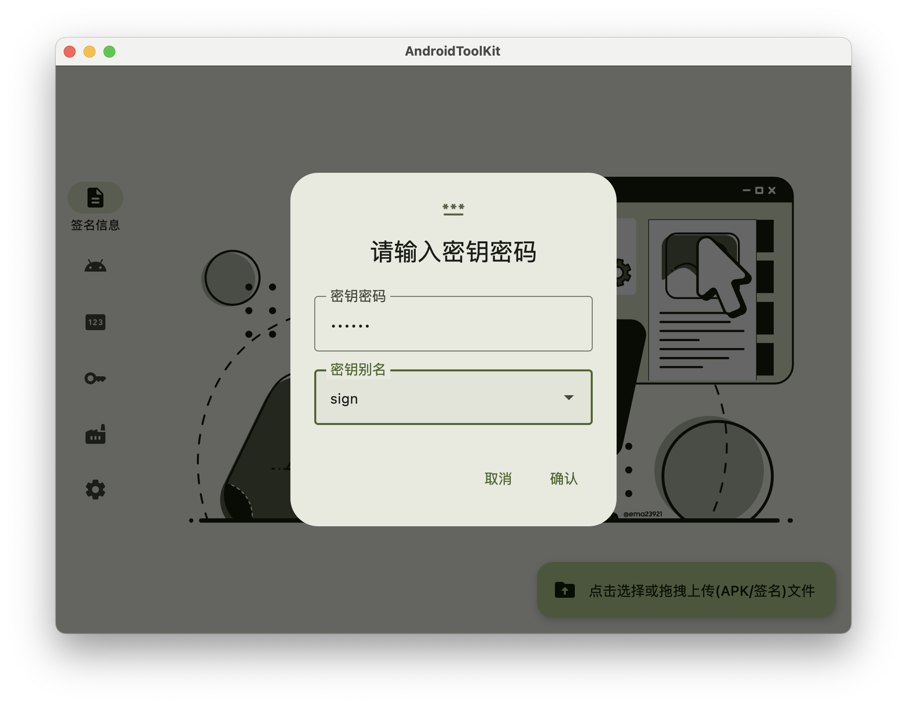
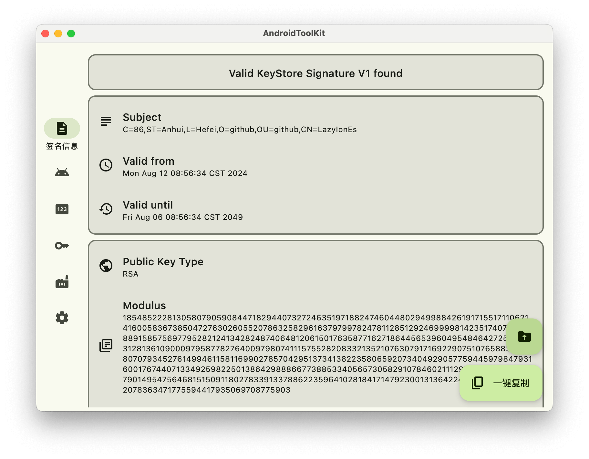
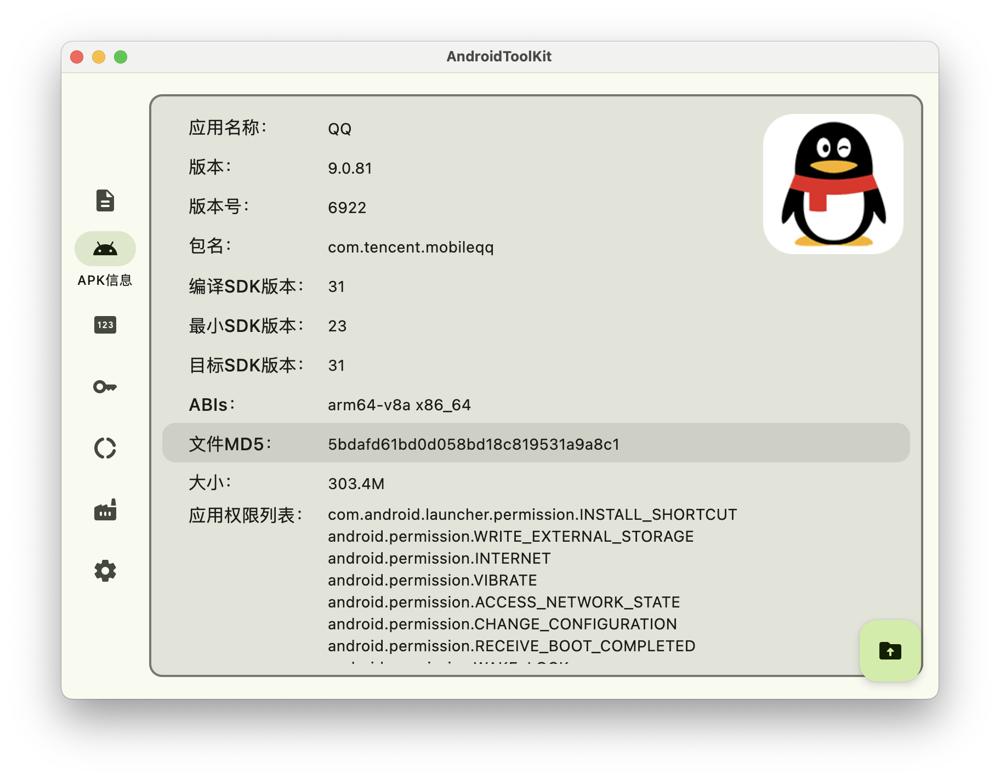
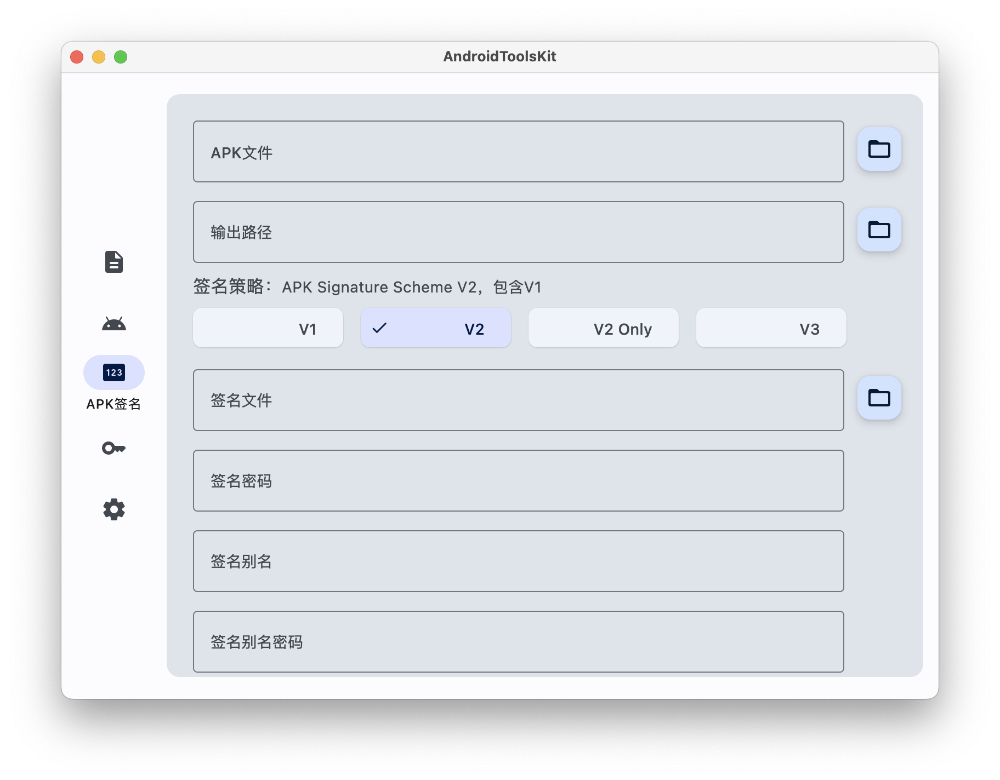
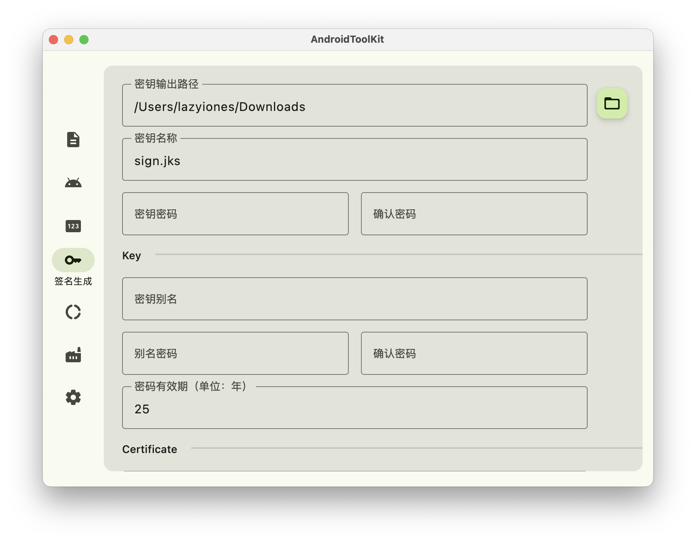
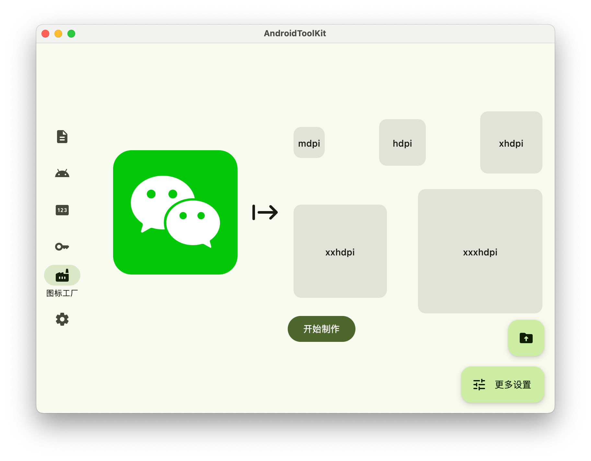
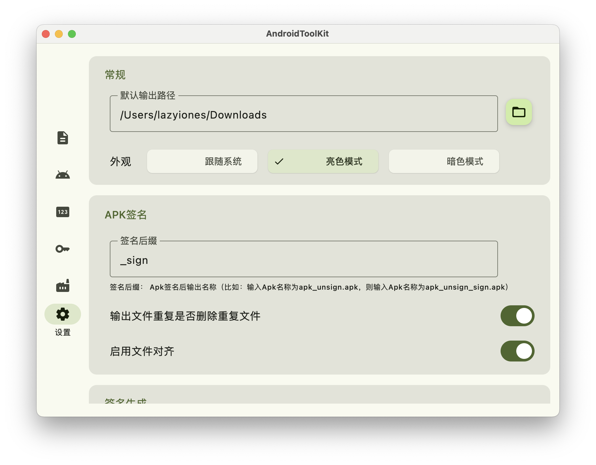
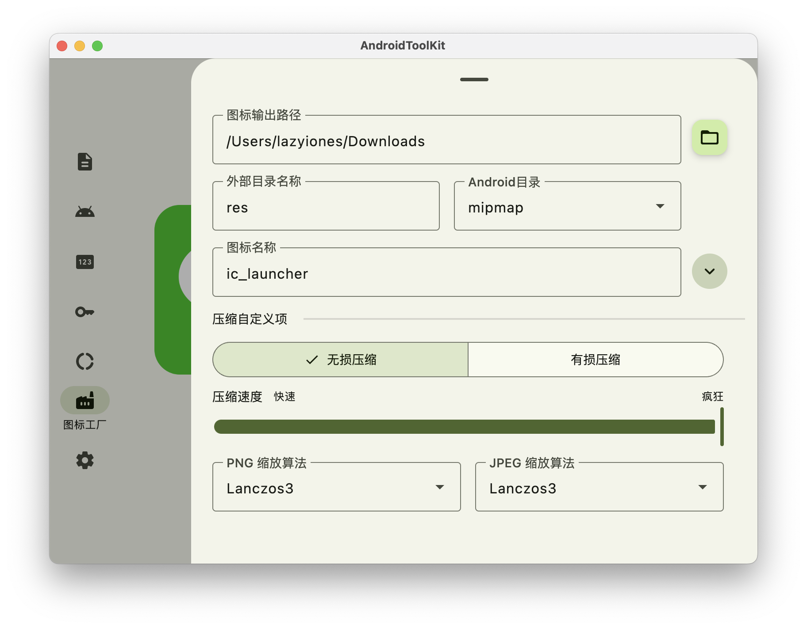
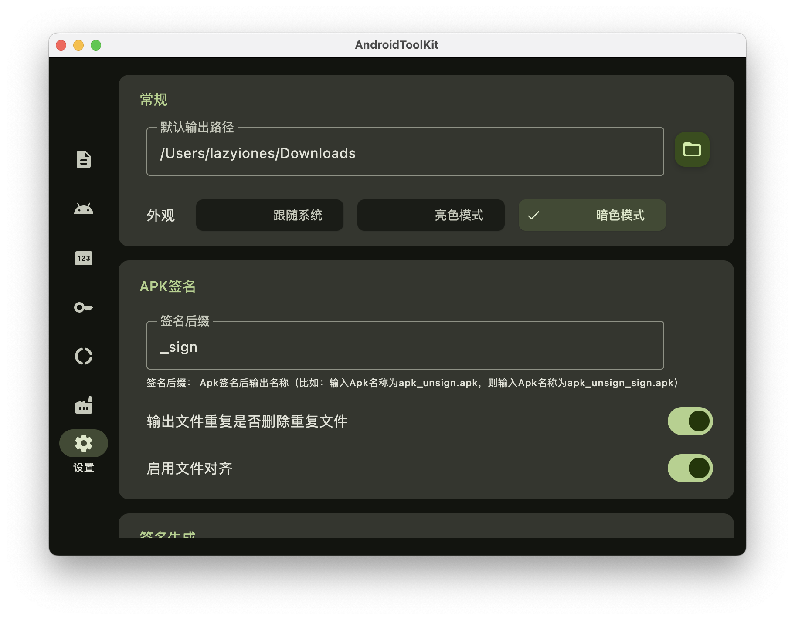

## AndroidToolKit

<p align="start">
<a href="https://opensource.org/license/mit"></a>

<a href="https://github.com/LazyIonEs/AndroidToolKit/actions"></a>
<a href="https://github.com/LazyIonEs/AndroidToolKit/releases/latest"></a>
<a href="https://github.com/LazyIonEs/AndroidToolKit/releases/latest"></a>
<a href="https://kotlinlang.org"></a>
<a href="https://www.rust-lang.org/"></a>
</p>


<!-- 


 -->

简体中文 | [English](./README_EN.md)

适用于安卓开发的桌面工具，支持 Windows、Mac 和 Linux  :tada:

> linux 平台未经测试，如有问题，请及时反馈

## 主要功能

- [x] 签名信息 - 分析(APK/签名)的签名信息（modulus、md5、sha-1、sha-256等）
- [x] APK信息 - 解析`AndroidManifest.xml`，提取部分信息
- [x] APK签名 - 对APK进行签名
- [x] 签名生成 - 生成签名证书
- [x] 图标生成 - 一键生成多尺寸图标
- [x] 缓存清理 - 按自定义规则扫描文件和文件夹，预览、选择并安全清理

> 支持APK签名校验；单签名校验（需输入签名密码）；文件拖拽；apk签名文件对齐；生成签名指定密钥类型，密钥大小；外观浅色深色模式。

## 缓存清理自定义规则

在「缓存清理 → 管理规则」中创建文件或文件夹规则。名称和相对路径支持等于、开头、结尾和包含；文件还支持大小超过指定 KB/MB/GB。组内选择满足全部或任意条件，已启用的组之间使用 OR。

规则编辑使用独立桌面窗口承载，默认 800×600 普通尺寸，支持移动和调整尺寸；主清理页保留当前结果，扫描完成后的底部悬浮工具栏也可进入。所有既有规则默认收起，每次展开一条；条件先显示可读摘要，点击后进入编辑。规则详情、条件编辑、其他选项与扫描设置通过高度和淡入淡出动画平滑切换，条件增删也带有动画。规则支持复制、排序、启停和默认勾选设置；取消会放弃草稿，右上角更多菜单中的恢复默认也仅修改草稿。「保存并试运行」保存并关闭规则窗口后打开目录选择器，新配置会清空旧扫描结果。

默认规则只匹配大小写一致的 `build` 文件夹，**`build.foo` 和 `Build` 不再命中**。新建规则默认勾选命中结果，可在其他选项中关闭。扫描和删除不跟随符号链接，删除前会按扫描快照重新核验路径、类型和规则，路径变化的项目会保留并显示失败原因。

| 浅色规则编辑页 | 深色规则编辑页 |
|:---:|:---:|
|  |  |

实现与验证说明见 [缓存清理自定义规则落地说明](docs/cache-cleaner-implementation.md)。

## 下载 - [Releases](https://github.com/LazyIonEs/AndroidToolKit/releases/latest)

|   设备    |          芯片           |                                                                                                                                                                                                                  下载                                                                                                                                                                                                                   |
|:-------:|:---------------------:|:-------------------------------------------------------------------------------------------------------------------------------------------------------------------------------------------------------------------------------------------------------------------------------------------------------------------------------------------------------------------------------------------------------------------------------------:|
|  macOS  | Apple Silicon (arm64) |                                                                                                                 <a href="https://github.com/LazyIonEs/AndroidToolKit/releases/latest/download/AndroidToolKit-macos-arm64.dmg"></a>                                                                                                                 |
|  macOS  |      Intel (x64)      |                                                                                                                    <a href="https://github.com/LazyIonEs/AndroidToolKit/releases/latest/download/AndroidToolKit-macos-x64.dmg"></a>                                                                                                                    |
| Windows |   x64 (Intel / AMD)   |     <a href="https://github.com/LazyIonEs/AndroidToolKit/releases/latest/download/AndroidToolKit-windows-x64.msi"></a> <a href="https://github.com/LazyIonEs/AndroidToolKit/releases/latest/download/AndroidToolKit-windows-x64.exe"></a>     |
| Windows |         ARM64         | <a href="https://github.com/LazyIonEs/AndroidToolKit/releases/latest/download/AndroidToolKit-windows-arm64.msi"></a> <a href="https://github.com/LazyIonEs/AndroidToolKit/releases/latest/download/AndroidToolKit-windows-arm64.exe"></a> |
|  Linux  | x64 (AMD64 / x86_64)  |        <a href="https://github.com/LazyIonEs/AndroidToolKit/releases/latest/download/AndroidToolKit-linux-amd64.deb"></a> <a href="https://github.com/LazyIonEs/AndroidToolKit/releases/latest/download/AndroidToolKit-linux-x86_64.rpm"></a>         |
|  Linux  |    ARM64 (aarch64)    |     <a href="https://github.com/LazyIonEs/AndroidToolKit/releases/latest/download/AndroidToolKit-linux-arm64.deb"></a> <a href="https://github.com/LazyIonEs/AndroidToolKit/releases/latest/download/AndroidToolKit-linux-aarch64.rpm"></a>     |

> [!CAUTION]
> Windows版请右键使用管理员权限安装，不然可能会遇到权限问题导致无法安装。遇到问题可以看看 [FAQ](FAQ.md)

## 截屏

|                                            签名信息                                             |                                            签名信息                                             |                                            签名信息                                             |
|:-------------------------------------------------------------------------------------------:|:-------------------------------------------------------------------------------------------:|:-------------------------------------------------------------------------------------------:|
|  |  |  |
|                                            APK信息                                            |                                            APK签名                                            |                                            签名生成                                             |
|        |          |   |
|                                            图标生成                                             |                                            缓存清理                                             |                                            黑白主题                                             |
|           |            |                    |
|                                            图标生成                                             |                                            缓存清理                                             |                                            黑白主题                                             |
|           |            |                     |

## 技术栈

- [Kotlin Multiplatform](https://kotlinlang.org/lp/multiplatform/)
- [Kotlin Coroutines](https://github.com/Kotlin/kotlinx.coroutines)
- [Compose Multiplatform](https://www.jetbrains.com/lp/compose-multiplatform/)
- [Kotlinx Serialization](https://github.com/Kotlin/kotlinx.serialization)
- [Rust](https://github.com/rust-lang/rust)
- [mozjpeg](https://github.com/mozilla/mozjpeg)
- [libimagequant](https://github.com/ImageOptim/libimagequant)
- [uniffi-rs](https://github.com/mozilla/uniffi-rs)

有关所使用依赖项的完整列表，请查看 [catalog](/gradle/libs.versions.toml) 文件

## 代码目录

| 目录 | 职责 |
| --- | --- |
| `composeApp/src/jvmMain` | 桌面应用入口和窗口装配 |
| `shared/src/commonMain/kotlin/org/tool/kit/domain` | 业务模型、仓库接口和用例 |
| `shared/src/commonMain/kotlin/org/tool/kit/feature` | 按功能组织页面、Route、ViewModel 和页面状态；`ui` 放公共 UI 组件 |
| `shared/src/commonMain/kotlin/org/tool/kit/core` | 协程、校验等基础能力 |
| `shared/src/jvmMain/kotlin/org/tool/kit/data` | JVM 仓库实现、数据源和生成器；更新传输及响应模型位于 `source/update` |
| `shared/src/jvmMain/kotlin/org/tool/kit/platform` | 文件选择、剪贴板及桌面系统能力 |
| `shared/src/jvmTest/kotlin/org/tool/kit/tests` | 按 `feature`、`domain`、`data`、`core`、`navigation`、`di`、`platform` 分组的测试；共用辅助代码放在 `support` |
| `rust/src` | 通过 UniFFI 提供给 Kotlin 的原生实现 |

设置页统一放在 `feature/setting`，更新弹窗与状态放在 `feature/update`。新增文件应与所属功能或层放在一起，包名与目录保持一致。导航键的包名参与状态序列化，调整位置时需检查已保存状态的恢复。

`composeResources`、`jvmMain/resources`、`composeApp/resources` 和 `composeApp/launcher` 存放资源、配置或打包文件，即使没有 Kotlin 代码也需要保留。`build`、Rust `target` 和 Gradle 缓存是构建产物，不属于源码目录。

## License

```
MIT License

Copyright (c) 2024 LazyIonEs

Permission is hereby granted, free of charge, to any person obtaining a copy
of this software and associated documentation files (the "Software"), to deal
in the Software without restriction, including without limitation the rights
to use, copy, modify, merge, publish, distribute, sublicense, and/or sell
copies of the Software, and to permit persons to whom the Software is
furnished to do so, subject to the following conditions:

The above copyright notice and this permission notice shall be included in all
copies or substantial portions of the Software.

THE SOFTWARE IS PROVIDED "AS IS", WITHOUT WARRANTY OF ANY KIND, EXPRESS OR
IMPLIED, INCLUDING BUT NOT LIMITED TO THE WARRANTIES OF MERCHANTABILITY,
FITNESS FOR A PARTICULAR PURPOSE AND NONINFRINGEMENT. IN NO EVENT SHALL THE
AUTHORS OR COPYRIGHT HOLDERS BE LIABLE FOR ANY CLAIM, DAMAGES OR OTHER
LIABILITY, WHETHER IN AN ACTION OF CONTRACT, TORT OR OTHERWISE, ARISING FROM,
OUT OF OR IN CONNECTION WITH THE SOFTWARE OR THE USE OR OTHER DEALINGS IN THE
SOFTWARE.
```
