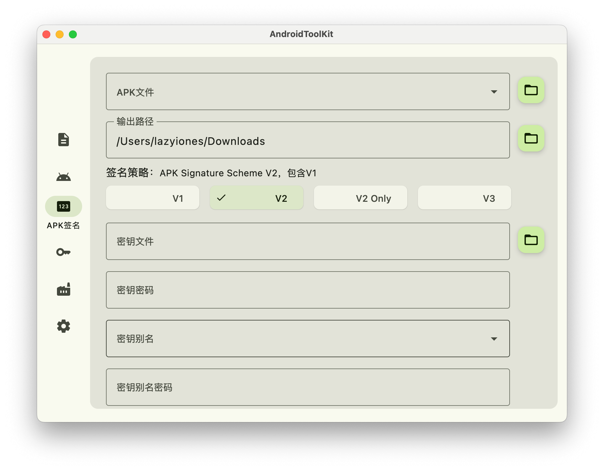
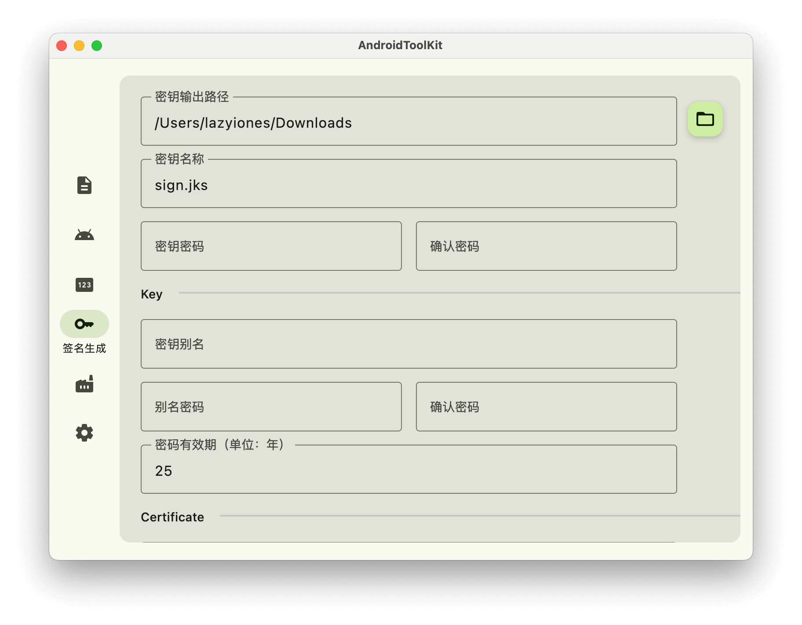

## AndroidToolKit

<!--  -->
适用于安卓开发的桌面工具，支持 Windows、Mac 和 Linux  :tada:
> linux 平台未经测试，如有问题，请及时反馈

### 主要功能
- [x] 签名信息 - 分析(APK/签名)的签名信息（modulus、md5、sha-1、sha-256等）
- [x] APK信息 - 解析`AndroidManifest.xml`，提取部分信息
- [x] APK签名 - 对APK进行签名
- [x] 签名生成 - 生成签名证书
- [x] 图标生成 - 一键生成多尺寸图标
- [ ] 图片压缩 - 压缩图片
- [ ] 检查更新 - 检查更新/自动更新（待定）
- [ ] 自定义主题 - 自定配色方案
> 支持APK签名校验；单签名校验（需输入签名密码）；文件拖拽；apk签名文件对齐；生成签名指定密钥类型，密钥大小；外观浅色深色模式。

### 下载安装
- [Github Releases](https://github.com/LazyIonEs/AndroidToolKit/releases)

| 设备 | 芯片 | 下载 |
|:----:|:----:|:----:|
| windows | amd/intel | AndroidToolKit-版本号-windows-x64.msi |
| macos | apple | AndroidToolKit-版本号-macos-arm64.dmg |
| macos | intel | AndroidToolKit-版本号-macos-x64.dmg |
| linux | - | AndroidToolKit-版本号-linux.deb |
> [!CAUTION]
> windows版不建议安装到C盘（默认安装路径是C盘 :clown_face:），可能会有权限等问题。遇到问题可以看看 [FAQ](FAQ.md) 

### 截屏
#### 签名信息

#### APK信息

#### APK签名

#### 签名生成

#### 图标生成

#### 黑白主题

### 技术栈
- [Kotlin Multiplatform](https://kotlinlang.org/lp/multiplatform/)
- [Kotlin Coroutines](https://github.com/Kotlin/kotlinx.coroutines)
- [Compose Multiplatform](https://www.jetbrains.com/lp/compose-multiplatform/)
- [Kotlinx Serialization](https://github.com/Kotlin/kotlinx.serialization)

有关所使用依赖项的完整列表，请查看 [catalog](/gradle/libs.versions.toml) 文件

### License

AndroidToolKit is licensed under the MIT license.
