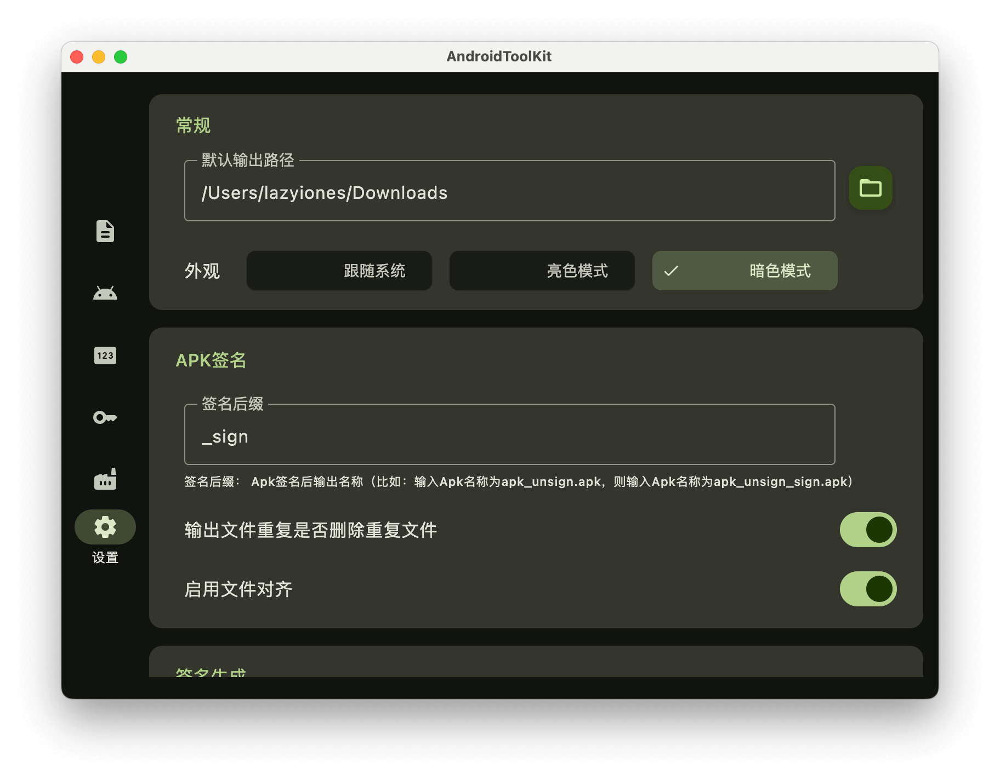

## AndroidToolKit

<p align="start">
<a href="https://opensource.org/license/mit"></a>

<a href="https://github.com/LazyIonEs/AndroidToolKit/actions"></a>
<a href="https://github.com/LazyIonEs/AndroidToolKit/releases/latest"></a>
<a href="https://github.com/LazyIonEs/AndroidToolKit/releases/latest"></a>
<a href="https://kotlinlang.org"></a>
</p>


<!-- 


 -->

简体中文 | [English](./README_EN.md)

适用于安卓开发的桌面工具，支持 Windows、Mac 和 Linux  :tada:

> linux 平台未经测试，如有问题，请及时反馈

## 主要功能

- [x] 签名信息 - 分析(APK/签名)的签名信息（modulus、md5、sha-1、sha-256等）
- [x] APK信息 - 解析`AndroidManifest.xml`，提取部分信息
- [x] APK签名 - 对APK进行签名
- [x] 签名生成 - 生成签名证书
- [x] 图标生成 - 一键生成多尺寸图标
- [ ] ~~图片压缩 - 压缩图片（预计开发新应用）~~

> 支持APK签名校验；单签名校验（需输入签名密码）；文件拖拽；apk签名文件对齐；生成签名指定密钥类型，密钥大小；外观浅色深色模式。

## 下载 - [Releases](https://github.com/LazyIonEs/AndroidToolKit/releases/latest)

|   设备    |     芯片      |                                                                                                                                  下载                                                                                                                                   |
|:-------:|:-----------:|:---------------------------------------------------------------------------------------------------------------------------------------------------------------------------------------------------------------------------------------------------------------------:|
|  macos  |    apple    |                                                                    [`macos-arm64.dmg`](https://github.com/LazyIonEs/AndroidToolKit/releases/latest/download/AndroidToolKit-1.5.3-macos-arm64.dmg)                                                                     |
|  macos  |    intel    |                                                                      [`macos-x64.dmg`](https://github.com/LazyIonEs/AndroidToolKit/releases/latest/download/AndroidToolKit-1.5.3-macos-x64.dmg)                                                                       |
| windows | intel / amd |  [`windows-x64.msi`](https://github.com/LazyIonEs/AndroidToolKit/releases/latest/download/AndroidToolKit-1.5.3-windows-x64.msi) **/** [`windows-x64.exe`](https://github.com/LazyIonEs/AndroidToolKit/releases/latest/download/AndroidToolKit-1.5.3-windows-x64.exe)  |
|  linux  |      -      | [`linux-amd64.deb`](https://github.com/LazyIonEs/AndroidToolKit/releases/latest/download/AndroidToolKit-1.5.3-linux-amd64.deb) **/** [`linux-x86_64.rpm`](https://github.com/LazyIonEs/AndroidToolKit/releases/latest/download/AndroidToolKit-1.5.3-linux-x86_64.rpm) |

> [!CAUTION]
> windows版不建议安装到C盘（默认安装路径是C盘 :clown_face:），可能会有权限等问题。遇到问题可以看看 [FAQ](FAQ.md)

## 截屏

### 签名信息


### APK信息


### APK签名


### 签名生成


### 图标生成


### 黑白主题




## 技术栈

- [Kotlin Multiplatform](https://kotlinlang.org/lp/multiplatform/)
- [Kotlin Coroutines](https://github.com/Kotlin/kotlinx.coroutines)
- [Compose Multiplatform](https://www.jetbrains.com/lp/compose-multiplatform/)
- [Kotlinx Serialization](https://github.com/Kotlin/kotlinx.serialization)

有关所使用依赖项的完整列表，请查看 [catalog](/gradle/libs.versions.toml) 文件

## License

```
MIT License

Copyright (c) 2024 LazyIonEs

Permission is hereby granted, free of charge, to any person obtaining a copy
of this software and associated documentation files (the "Software"), to deal
in the Software without restriction, including without limitation the rights
to use, copy, modify, merge, publish, distribute, sublicense, and/or sell
copies of the Software, and to permit persons to whom the Software is
furnished to do so, subject to the following conditions:

The above copyright notice and this permission notice shall be included in all
copies or substantial portions of the Software.

THE SOFTWARE IS PROVIDED "AS IS", WITHOUT WARRANTY OF ANY KIND, EXPRESS OR
IMPLIED, INCLUDING BUT NOT LIMITED TO THE WARRANTIES OF MERCHANTABILITY,
FITNESS FOR A PARTICULAR PURPOSE AND NONINFRINGEMENT. IN NO EVENT SHALL THE
AUTHORS OR COPYRIGHT HOLDERS BE LIABLE FOR ANY CLAIM, DAMAGES OR OTHER
LIABILITY, WHETHER IN AN ACTION OF CONTRACT, TORT OR OTHERWISE, ARISING FROM,
OUT OF OR IN CONNECTION WITH THE SOFTWARE OR THE USE OR OTHER DEALINGS IN THE
SOFTWARE.
```
