## AndroidToolKit

<p align="start">
<a href="https://opensource.org/license/mit"></a>

<a href="https://github.com/LazyIonEs/AndroidToolKit/actions"></a>
<a href="https://github.com/LazyIonEs/AndroidToolKit/releases/latest"></a>
<a href="https://github.com/LazyIonEs/AndroidToolKit/releases/latest"></a>
<a href="https://kotlinlang.org"></a>
<a href="https://www.rust-lang.org/"></a>
</p>


<!-- 


 -->


[简体中文](./README.md) | English

Desktop tools applicable to Android development, supporting Windows, Mac and Linux :tada:
> The Linux platform has not been tested. If you have any questions, please give us feedback in
> time.

## Key Features

- [x] Signature Information - Analyze the signature information of (APK/Signature) (modulus, md5,
  sha-1, sha-256, etc.)
- [x] APK Information - Parse `AndroidManifest.xml` and extract some information
- [x] APK Signature - Sign your APK
- [x] Signature Generation - Generate a signed certificate
- [x] Icon Generation - Generate icons of multiple sizes with one click
- [x] Cache Cleaner - Cleans the Android project cache directory

> Supports APK signature verification; single signature verification (signature password required);
> file dragging; apk
> signature file alignment; generate signatures with specified key type and key size; appearance
> light and dark modes.

## Download - [Releases](https://github.com/LazyIonEs/AndroidToolKit/releases/latest)

| device  |         chip          |                                                                                                                                                                                                               download                                                                                                                                                                                                                |
|:-------:|:---------------------:|:-------------------------------------------------------------------------------------------------------------------------------------------------------------------------------------------------------------------------------------------------------------------------------------------------------------------------------------------------------------------------------------------------------------------------------------:|
|  macOS  | Apple Silicon (arm64) |                                                                                                                 <a href="https://github.com/LazyIonEs/AndroidToolKit/releases/latest/download/AndroidToolKit-macos-arm64.dmg"></a>                                                                                                                 |
|  macOS  |      Intel (x64)      |                                                                                                                    <a href="https://github.com/LazyIonEs/AndroidToolKit/releases/latest/download/AndroidToolKit-macos-x64.dmg"></a>                                                                                                                    |
| Windows |   x64 (Intel / AMD)   |     <a href="https://github.com/LazyIonEs/AndroidToolKit/releases/latest/download/AndroidToolKit-windows-x64.msi"></a> <a href="https://github.com/LazyIonEs/AndroidToolKit/releases/latest/download/AndroidToolKit-windows-x64.exe"></a>     |
| Windows |         ARM64         | <a href="https://github.com/LazyIonEs/AndroidToolKit/releases/latest/download/AndroidToolKit-windows-arm64.msi"></a> <a href="https://github.com/LazyIonEs/AndroidToolKit/releases/latest/download/AndroidToolKit-windows-arm64.exe"></a> |
|  Linux  | x64 (AMD64 / x86_64)  |        <a href="https://github.com/LazyIonEs/AndroidToolKit/releases/latest/download/AndroidToolKit-linux-amd64.deb"></a> <a href="https://github.com/LazyIonEs/AndroidToolKit/releases/latest/download/AndroidToolKit-linux-x86_64.rpm"></a>         |
|  Linux  |    ARM64 (aarch64)    |     <a href="https://github.com/LazyIonEs/AndroidToolKit/releases/latest/download/AndroidToolKit-linux-arm64.deb"></a> <a href="https://github.com/LazyIonEs/AndroidToolKit/releases/latest/download/AndroidToolKit-linux-aarch64.rpm"></a>     |

> [!CAUTION]
> For the Windows version, please right-click and install with administrator privileges; otherwise,
> you may encounter permission issues that prevent installation. If you encounter problems, please
> refer to... [FAQ](FAQ.md)

## screenshot

|                                     Signature Information                                      |                                     Signature Information                                      |                                     Signature Information                                      |
|:----------------------------------------------------------------------------------------------:|:----------------------------------------------------------------------------------------------:|:----------------------------------------------------------------------------------------------:|
| 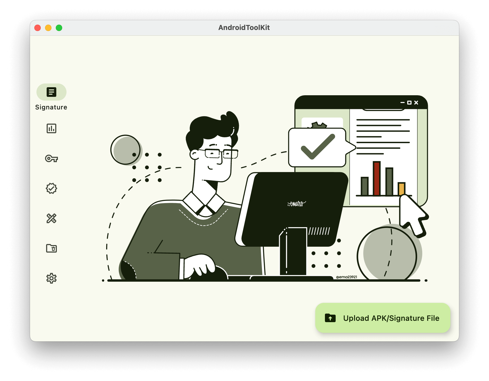 | 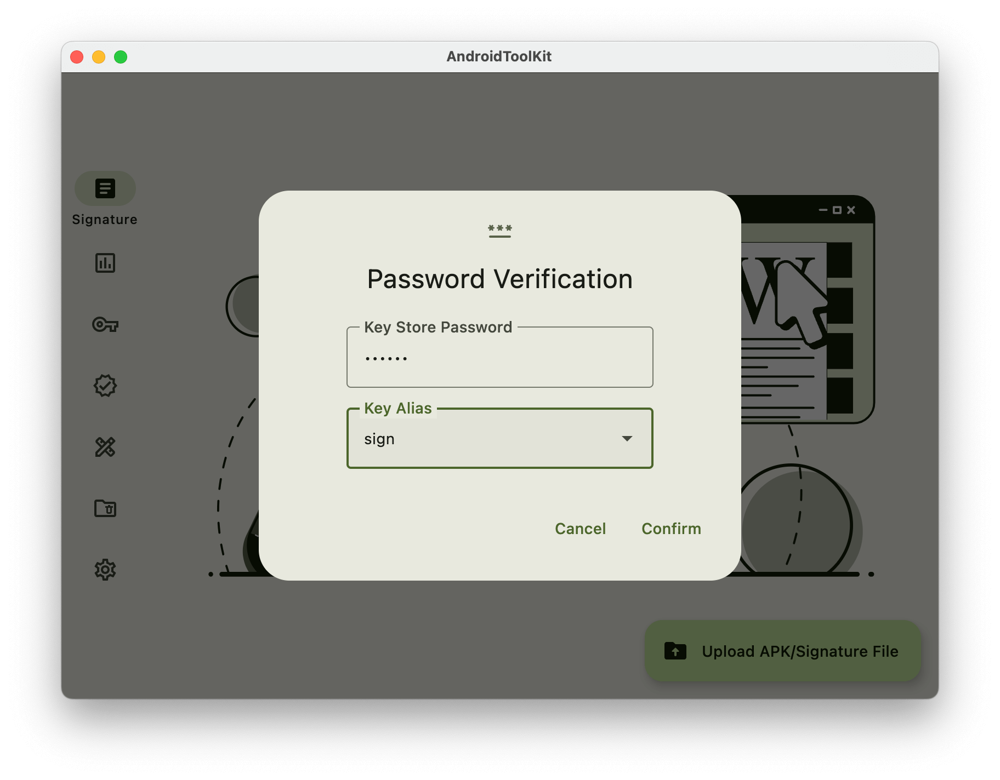 | 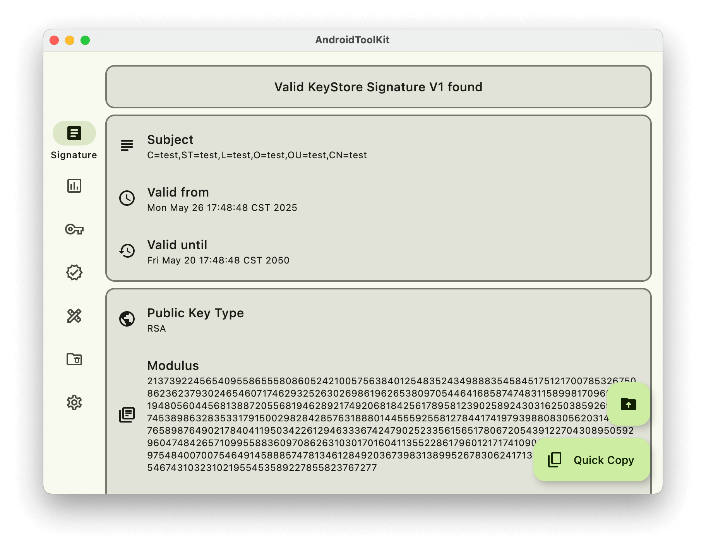 |
|                                        APK Information                                         |                                         APK Signature                                          |                                      Signature generation                                      |
|    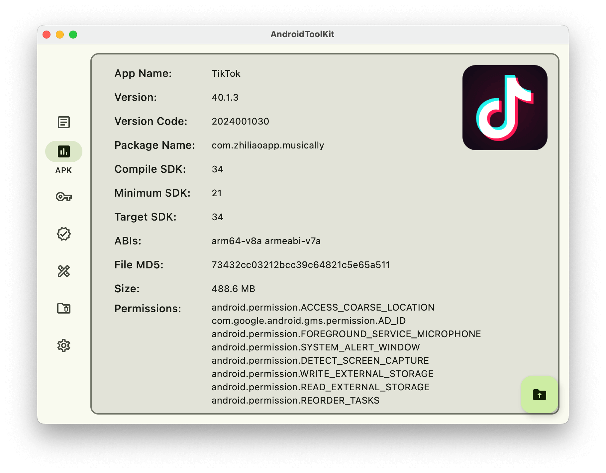    |     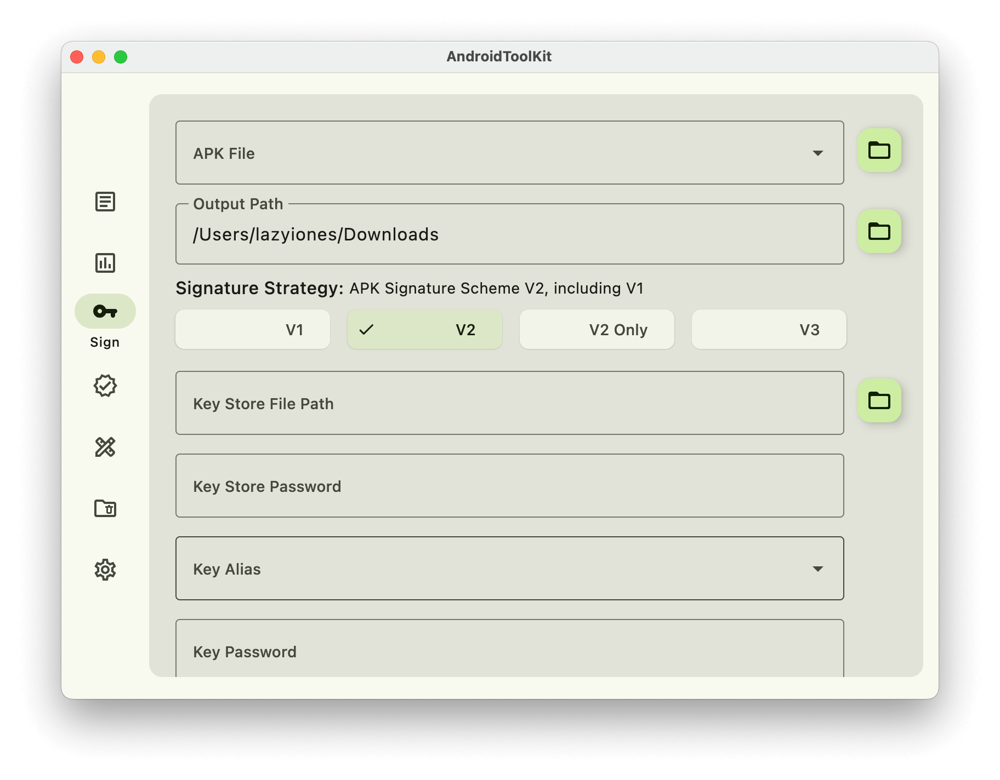     | 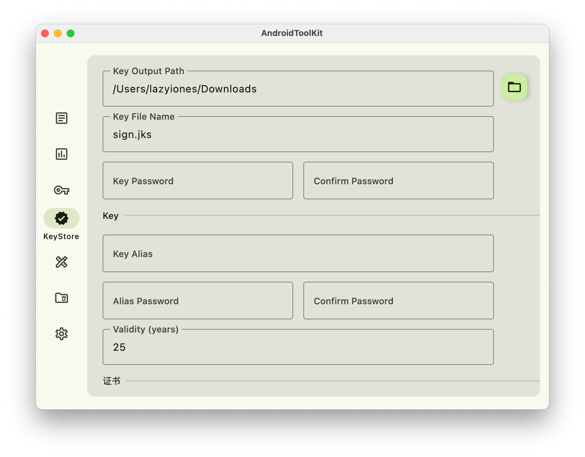  |
|                                        Icon Generation                                         |                                         Cache Cleaner                                          |                                     Black and white theme                                      |
|     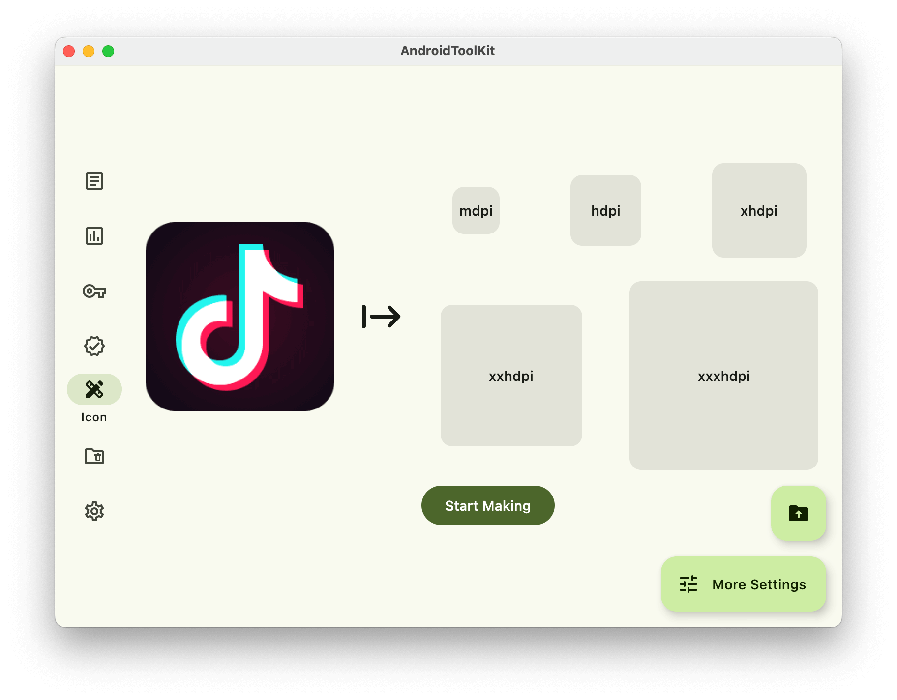      |      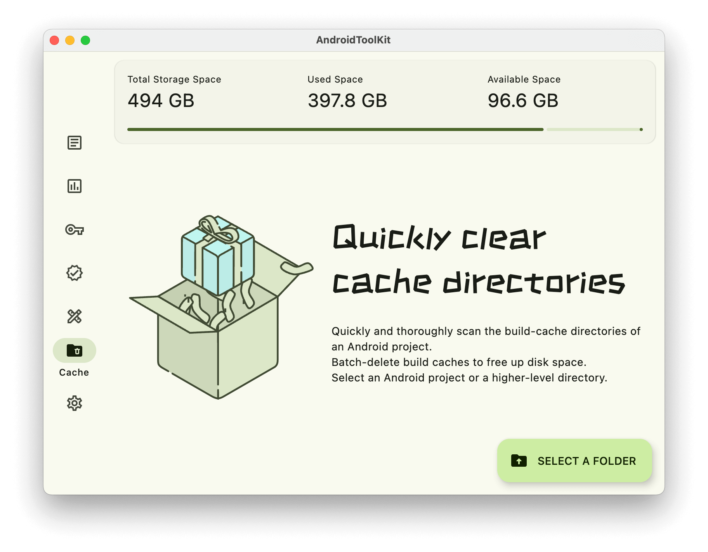      |          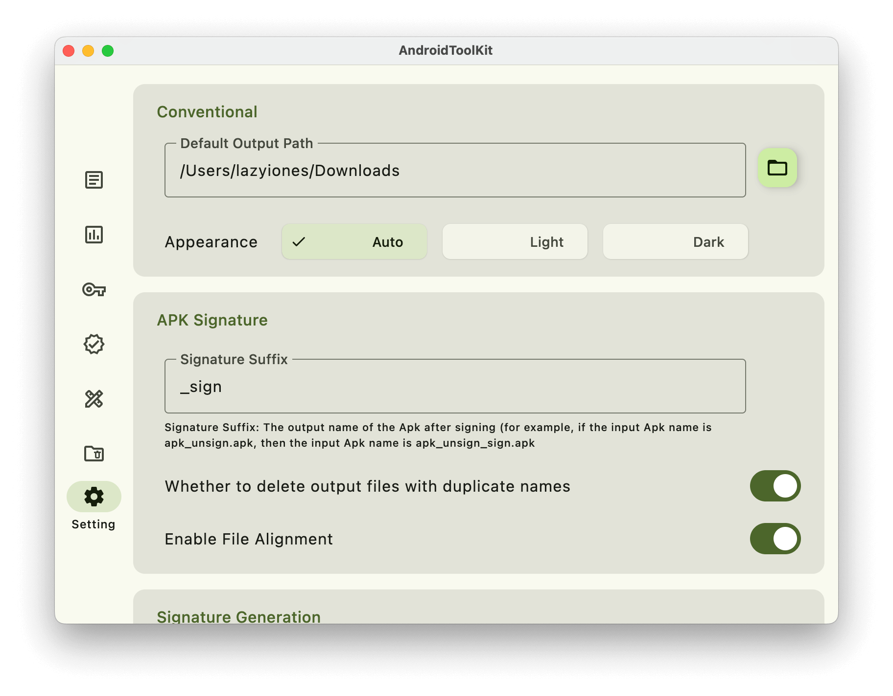          |
|                                        Icon Generation                                         |                                         Cache Cleaner                                          |                                     Black and white theme                                      |
|     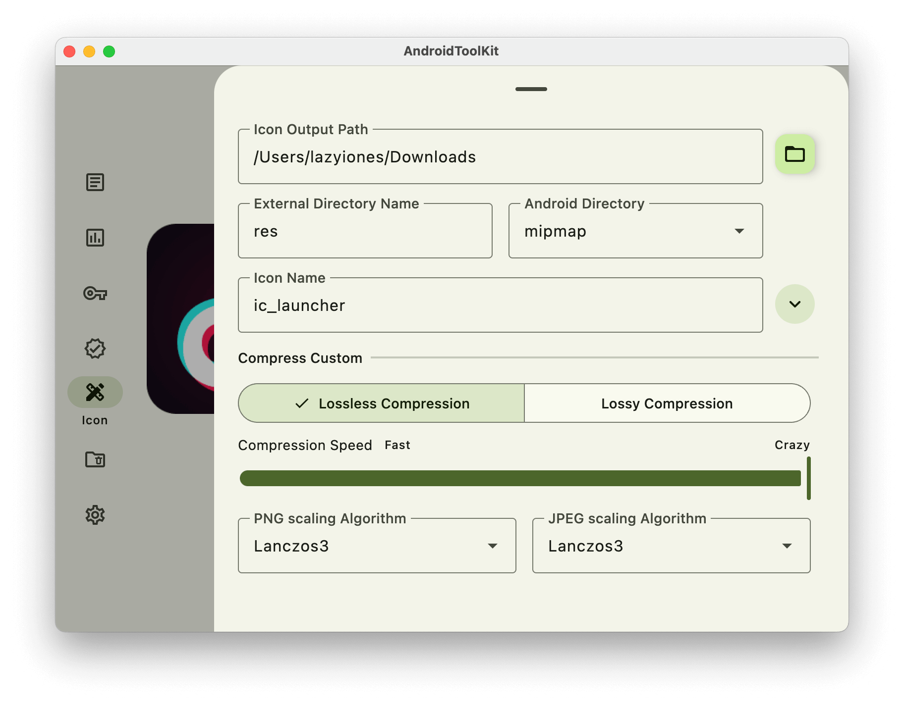      |      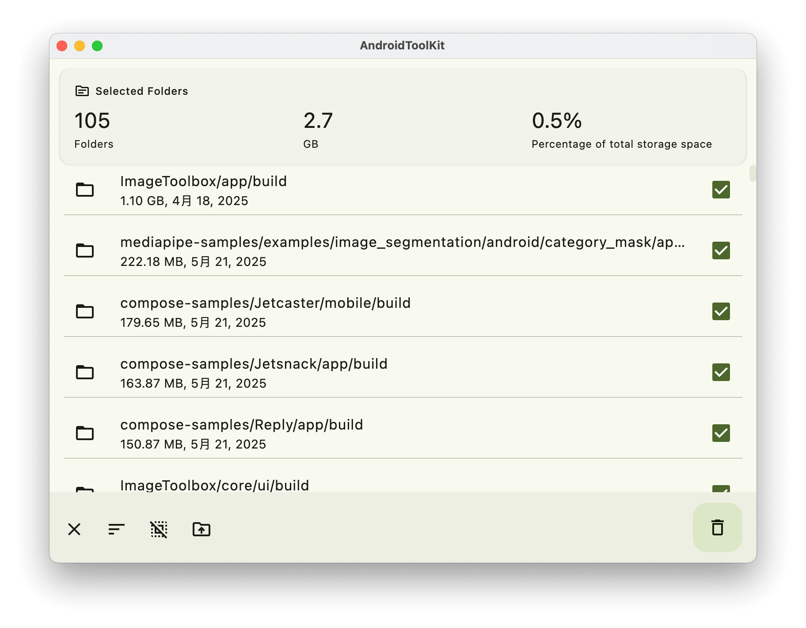      |          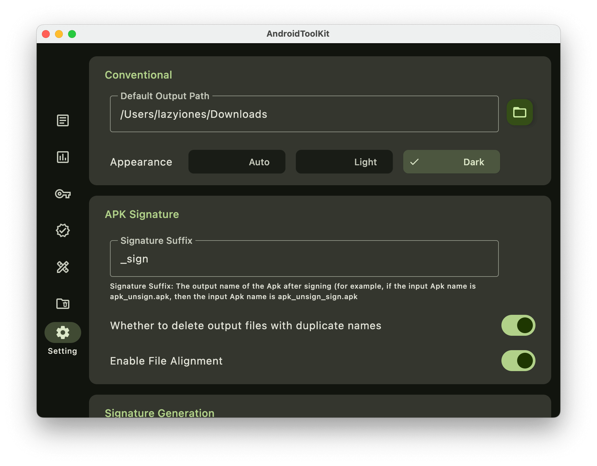           |

## Technology Stack

- [Kotlin Multiplatform](https://kotlinlang.org/lp/multiplatform/)
- [Kotlin Coroutines](https://github.com/Kotlin/kotlinx.coroutines)
- [Compose Multiplatform](https://www.jetbrains.com/lp/compose-multiplatform/)
- [Kotlinx Serialization](https://github.com/Kotlin/kotlinx.serialization)
- [Rust](https://github.com/rust-lang/rust)
- [mozjpeg](https://github.com/mozilla/mozjpeg)
- [libimagequant](https://github.com/ImageOptim/libimagequant)
- [uniffi-rs](https://github.com/mozilla/uniffi-rs)

For a complete list of dependencies used, check the [catalog](/gradle/libs.versions.toml) file

## License

```
MIT License

Copyright (c) 2024 LazyIonEs

Permission is hereby granted, free of charge, to any person obtaining a copy
of this software and associated documentation files (the "Software"), to deal
in the Software without restriction, including without limitation the rights
to use, copy, modify, merge, publish, distribute, sublicense, and/or sell
copies of the Software, and to permit persons to whom the Software is
furnished to do so, subject to the following conditions:

The above copyright notice and this permission notice shall be included in all
copies or substantial portions of the Software.

THE SOFTWARE IS PROVIDED "AS IS", WITHOUT WARRANTY OF ANY KIND, EXPRESS OR
IMPLIED, INCLUDING BUT NOT LIMITED TO THE WARRANTIES OF MERCHANTABILITY,
FITNESS FOR A PARTICULAR PURPOSE AND NONINFRINGEMENT. IN NO EVENT SHALL THE
AUTHORS OR COPYRIGHT HOLDERS BE LIABLE FOR ANY CLAIM, DAMAGES OR OTHER
LIABILITY, WHETHER IN AN ACTION OF CONTRACT, TORT OR OTHERWISE, ARISING FROM,
OUT OF OR IN CONNECTION WITH THE SOFTWARE OR THE USE OR OTHER DEALINGS IN THE
SOFTWARE.
```
