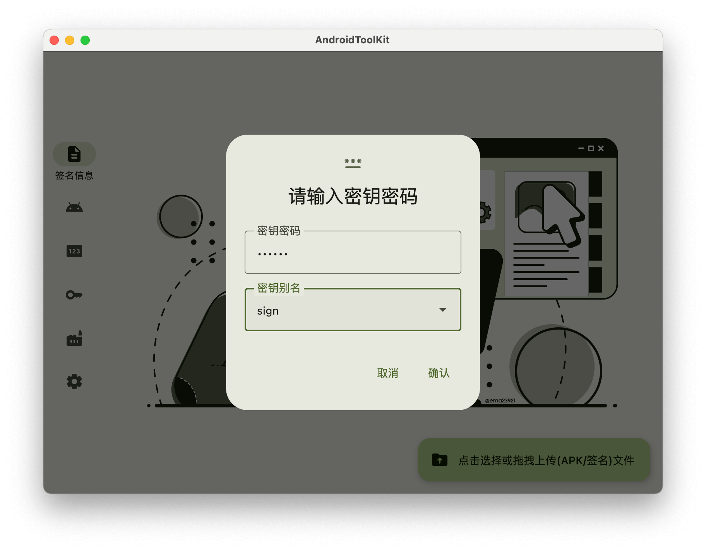
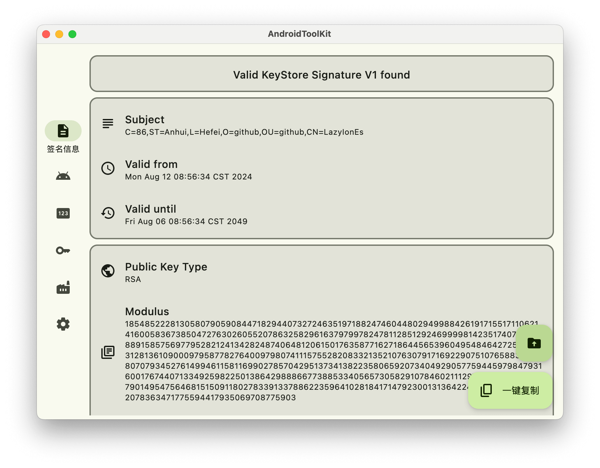
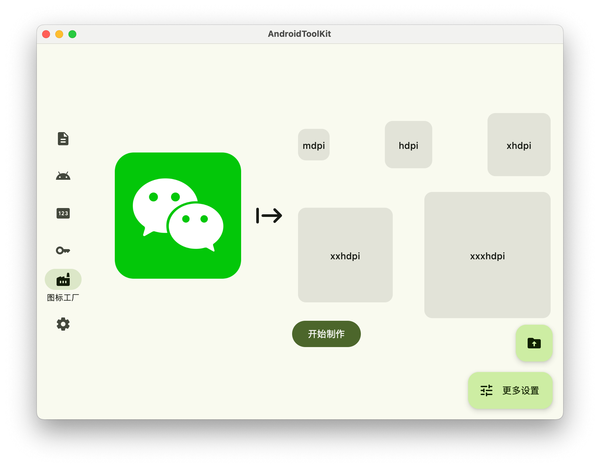
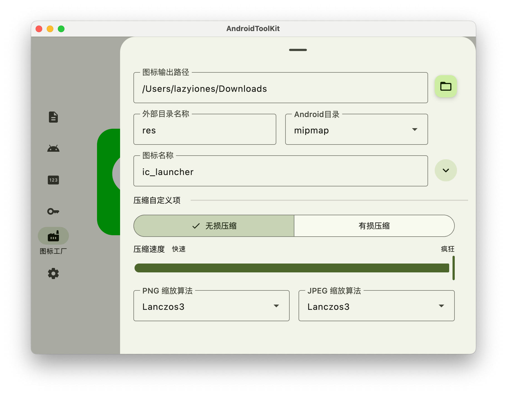
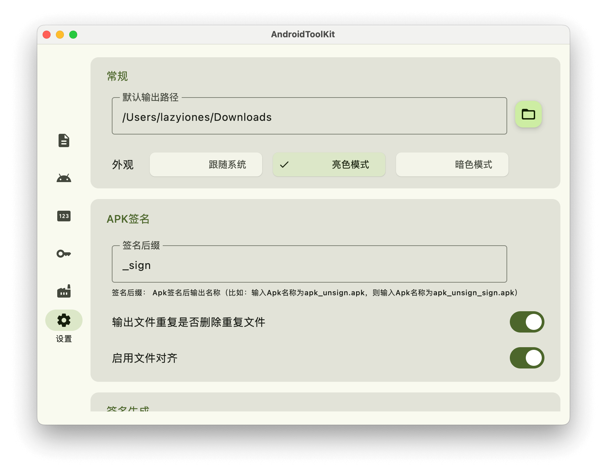

## AndroidToolKit

<!--  -->

[简体中文](./README.md) | English

Desktop tools applicable to Android development, supporting Windows, Mac and Linux :tada:
> The Linux platform has not been tested. If you have any questions, please give us feedback in time.

### Key Features
- [x] Signature Information - Analyze the signature information of (APK/Signature) (modulus, md5, sha-1, sha-256, etc.)
- [x] APK Information - Parse `AndroidManifest.xml` and extract some information
- [x] APK Signature - Sign your APK
- [x] Signature Generation - Generate a signed certificate
- [x] Icon Generation - Generate icons of multiple sizes with one click
- [ ] Image Compression - Compress images
- [ ] Check for updates - Check for updates/auto-updates (pending)
- [ ] Custom themes - custom color schemes
> Supports APK signature verification; single signature verification (signature password required); file dragging; apk signature file alignment; generate signatures with specified key type and key size; appearance light and dark modes.

### Download and install
- [Github Releases](https://github.com/LazyIonEs/AndroidToolKit/releases)

| device | chip | download |
|:----:|:----:|:----:|
| windows | amd/intel | AndroidToolKit-Version Number-windows-x64.msi |
| macos | apple | AndroidToolKit-Version Number-macos-arm64.dmg |
| macos | intel | AndroidToolKit-Version Number-macos-x64.dmg |
| linux | - | AndroidToolKit-Version Number-linux.deb |
> [!CAUTION]
> It is not recommended to install the Windows version to the C drive (the default installation path is the C drive :clown_face:), which may cause problems such as permissions. If you encounter any problems, please refer to [FAQ](FAQ.md)

### screenshot
#### Signature Information

#### APK Information

#### APK Signature

#### Signature generation

#### Icon Generation

#### Black and white theme

### Technology Stack
- [Kotlin Multiplatform](https://kotlinlang.org/lp/multiplatform/)
- [Kotlin Coroutines](https://github.com/Kotlin/kotlinx.coroutines)
- [Compose Multiplatform](https://www.jetbrains.com/lp/compose-multiplatform/)
- [Kotlinx Serialization](https://github.com/Kotlin/kotlinx.serialization)

For a complete list of dependencies used, check the [catalog](/gradle/libs.versions.toml) file

### License

AndroidToolKit is licensed under the MIT license.
